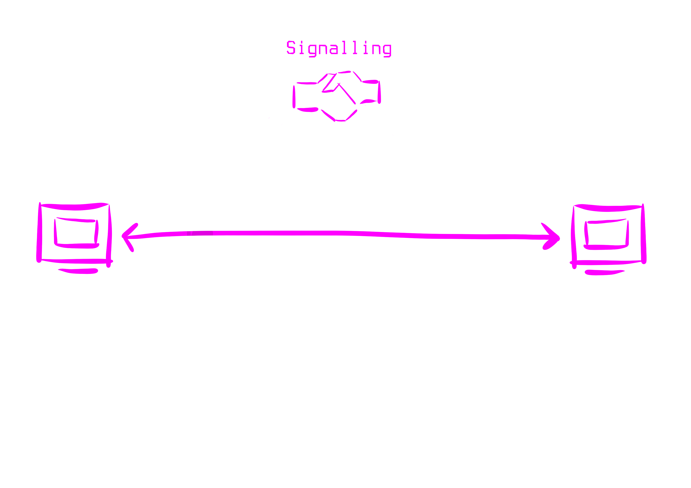
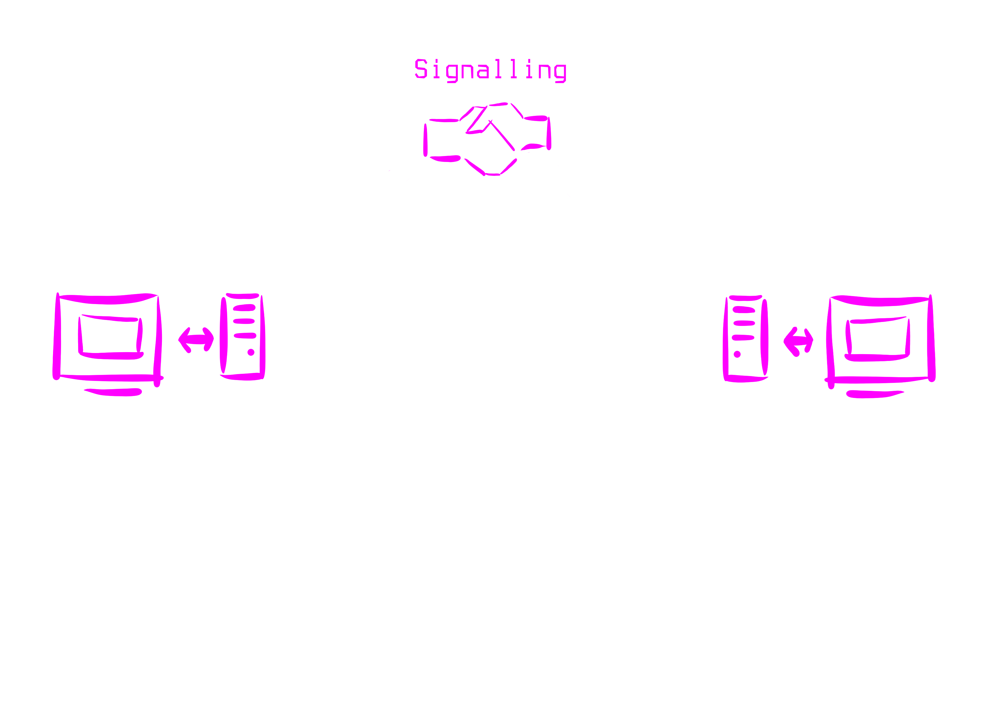
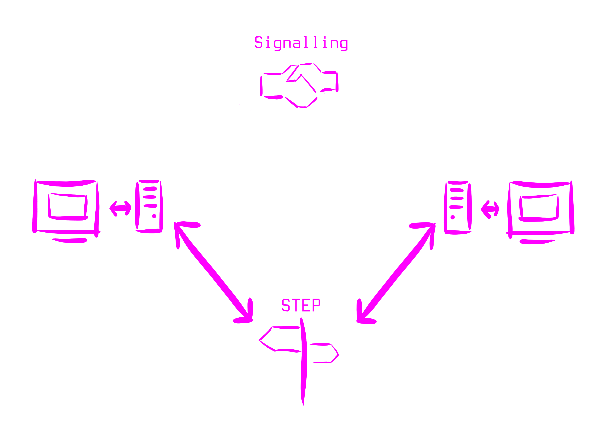
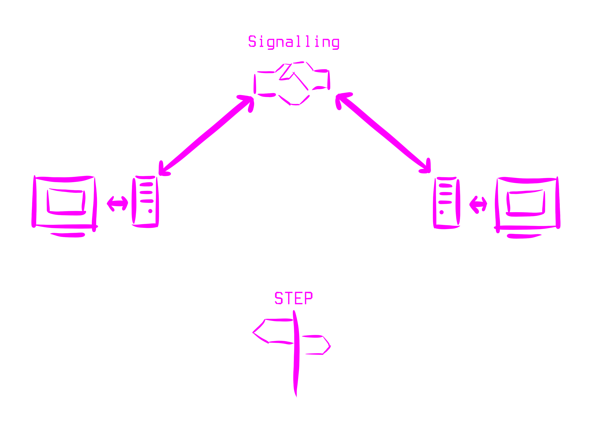
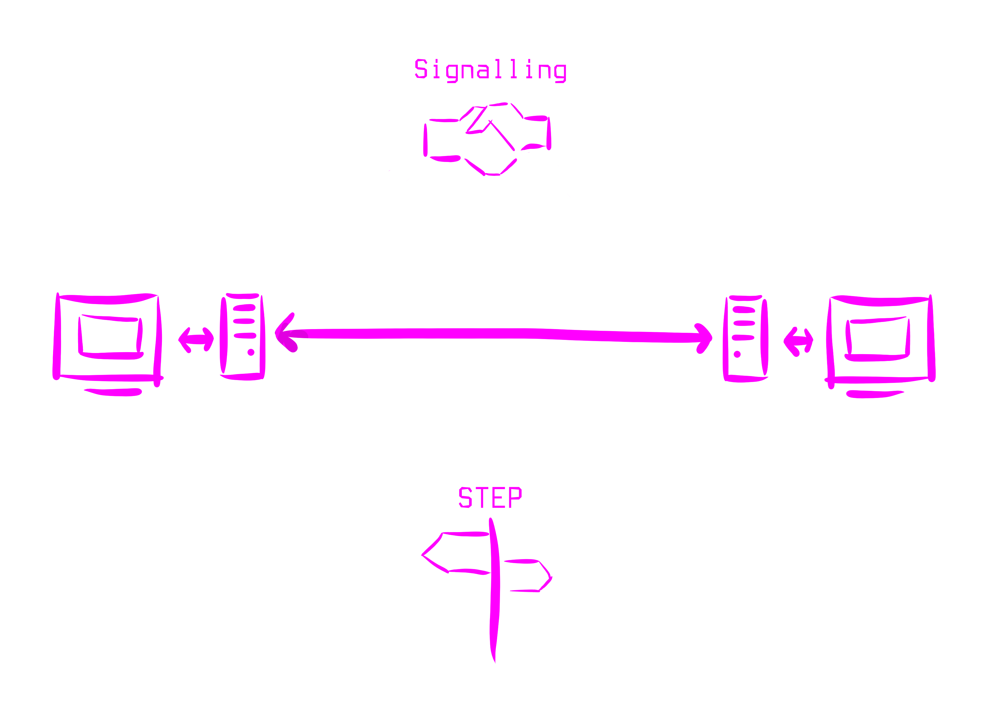
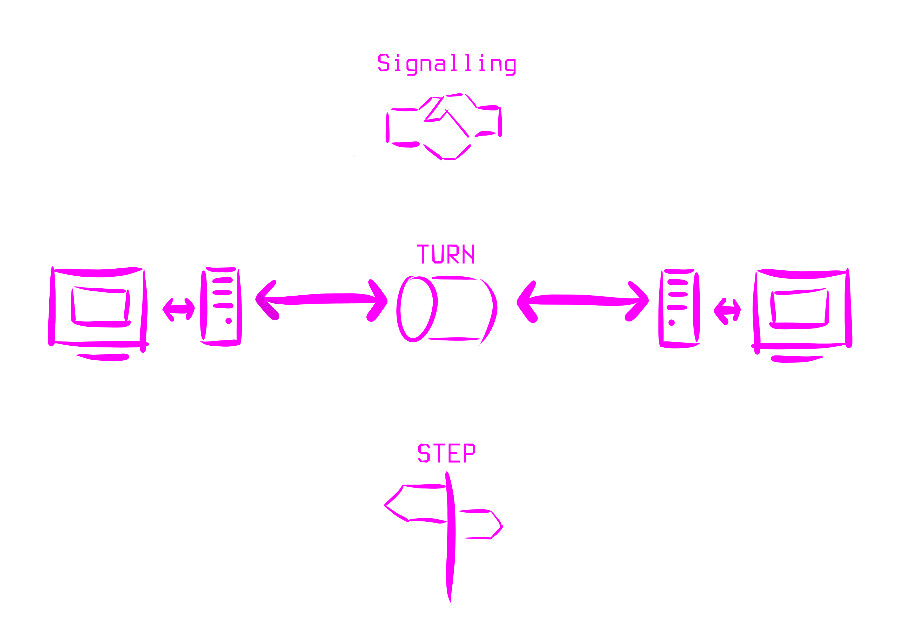

# Building a Peer to Peer System with TypeScript

Jonathan 

---

Note: test

----

----

----

----

----

----

----

---

## Features

- Less Bandwidth Use
- Less Visibility
- Less Control
- Storing data is difficult

Notes: Use Cases

- Gaming
- File/data sharing
- Voice & Video Applications
- Messaging

---

## Learn More

